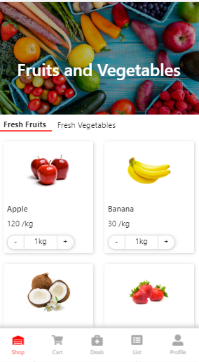
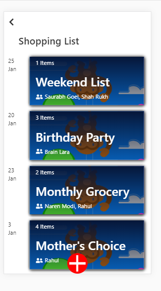
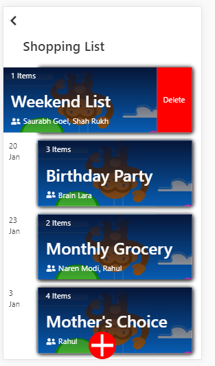

## Instructions for running project
```
git clone https://github.com/shubh648/Shopping-Cart.git
cd Shopping-Cart
npm i
npm start
```

# Note:
This is mobile version dummy web app for shoping cart. so, look as mobile view.
